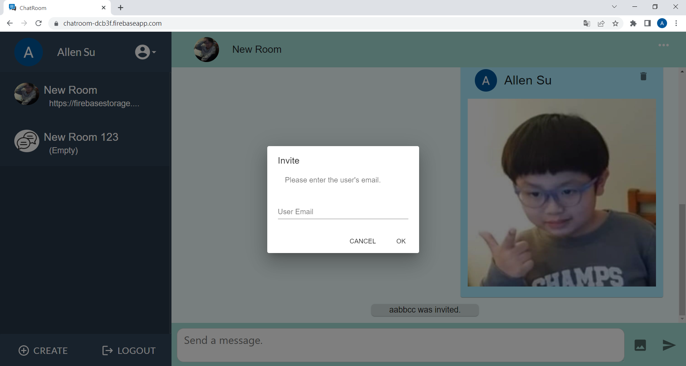
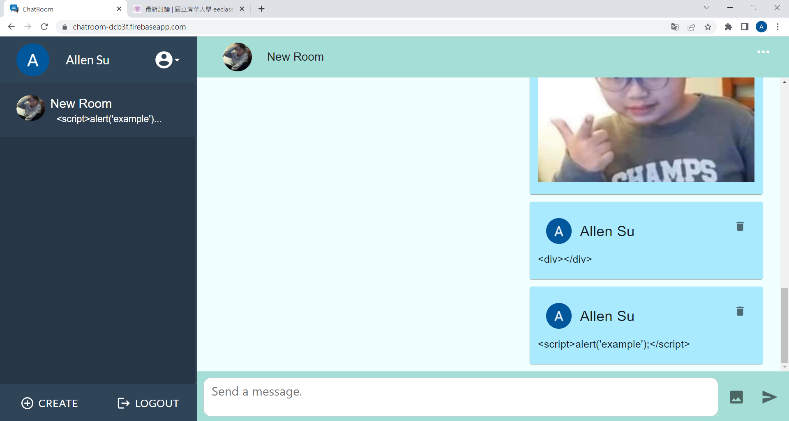

# Software Studio 2022 Spring Midterm Project

### Scoring

| **Basic components**                             | **Score** | **Check** |
| :----------------------------------------------- | :-------: | :-------: |
| Membership Mechanism                             | 15%       | Y         |
| Firebase page                                    | 5%        | Y         |
| Database read/write                              | 15%       | Y         |
| RWD                                              | 15%       | Y         |
| Chatroom                                         | 20%       | Y         |

| **Advanced tools**                               | **Score** | **Check** |
| :----------------------------------------------- | :-------: | :-------: |
| Using React                                      | 10%       | Y         |
| Third-Party Sign In                              | 1%        | Y         |
| Notification                                     | 5%        | Y         |
| CSS Animation                                    | 2%        | N         |
| Security                                         | 2%        | Y         |

| **Other useful functions**                         | **Score** | **Check** |
| :----------------------------------------------- | :-------: | :-------: |
| Profile picture                                   | 1%       | Y         |
| Send image                                        | 1%       | Y         |
| Unsend message                                    | 3%       | Y         |

---

### How to use

You must sign up with your email or google account at first.&nbsp;&nbsp;(
Signup, Signin pages were rendered by React Router.&nbsp;&nbsp;If you haven't sign in, it will redirect to signin page.)

 

#### Interface

Sidebar

Room

 
 

### Function description

Set user profile.

Create a new room.

Edit room profile.

Show members in this room.

Invite other user to this room.

It will show notification if you join in a room of leave a room.

The commands won't take effect.

 
 

### RWD

The interface in mobile devices.&nbsp;&nbsp;It only shows one side in mobile devices

 
 

### Others (Optional)

If you encounter any error, it will show an alert.

If you connect to the server such like read data/write data or upload image, it will show a progressing animation.

All components in ChatRoom were rendered by React.

 
 

### Firebase page link

&nbsp;&nbsp;&nbsp;&nbsp;[Firebase page](https://chatroom-dcb3f.firebaseapp.com/)

